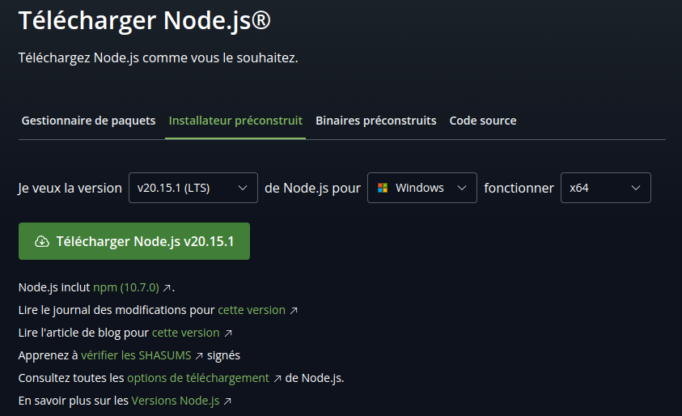
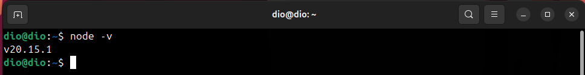
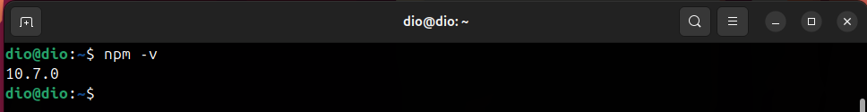
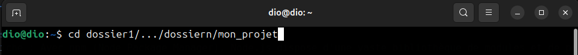
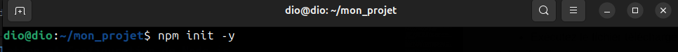
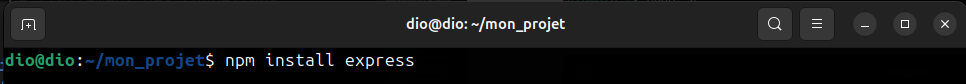
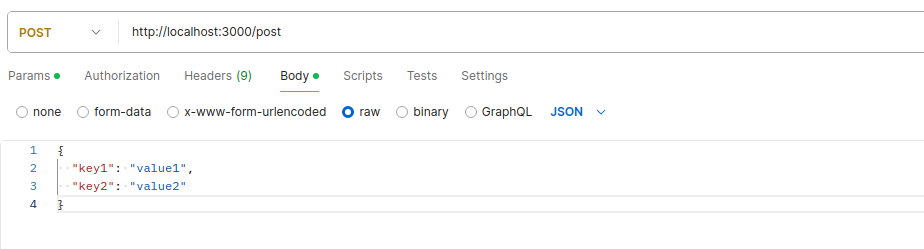
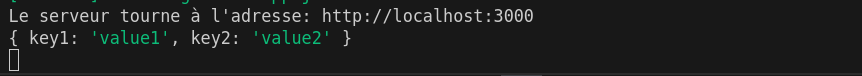
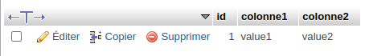

# Node.js
Node.js est une plateforme JavaScript côté serveur, elle révolutionne le développement web en permettant la création d'applications rapides et efficaces grâce à son architecture non-bloquante. Express est un framework minimaliste et flexible qui simplifie la création de serveurs web robustes.
Au cours de cette formation, vous apprendrez à :

- Configurer un environnement Node.js,
- Utiliser Express pour créer des serveurs et gérer des routes,
- Intégrer et manipuler des bases de données SQL,
- Implémenter des fonctionnalités avancées comme l'authentification des utilisateurs.

### Qu'est-ce que Node.js ?
Node.js est une plateforme d'exécution JavaScript côté serveur, construite sur le moteur V8 de Google Chrome. Elle permet d'exécuter du JavaScript en dehors du navigateur, offrant ainsi la possibilité de créer des applications serveur rapides et évolutives.

### Caractéristiques clés de Node.js
- Non-bloquant et asynchrone : Grâce à son modèle d'entrées/sorties non-bloquantes, Node.js peut gérer de nombreuses connexions simultanément sans ralentissement.
- Écosystème riche : Avec npm (Node Package Manager), Node.js dispose d'une vaste bibliothèque de modules et de packages prêts à l'emploi pour accélérer le développement.
- Unifié : Utiliser JavaScript à la fois côté client et côté serveur simplifie le développement et le partage de code entre les deux environnements.

Node.js est particulièrement adapté pour les applications web en temps réel, les API, et les services nécessitant des performances élevées et une grande capacité de traitement des connexions simultanées.

### Installation et Configuration de Node.js
#### Installation de Node.js et npm
1) Télécharger Node.js
    - Allez sur le site officiel de Node.js : https://nodejs.org/
    - Téléchargez la version LTS (Long Term Support) pour plus de stabilité.
    
2) Installer Node.js
    - Exécutez le fichier téléchargé et suivez les instructions de l'assistant d'installation.
3) Vérifier l'installation
    - Ouvrez votre terminal (ou invite de commande) et tapez
    
    
Vous devriez voir les versions de Node.js et npm s'afficher, confirmant leur installation.

### Initialiser un Projet Node.js
1) Créer un répertoire de projet
    - Dans votre terminal, naviguez vers le répertoire que vous venez de créer
    
2) Initialiser le projet
    - Dans le terminal exécutez la commande suivante
    
    Cela crée un fichier package.json avec les paramètres par défaut.

### Express
Express est un framework Node.js, conçu pour simplifier la création et la gestion d'applications.
1) Installer express:
Dans le répertoire de votre projet, exécutez la commande suivante:


2) Créer un serveur Express de base :
Créez un fichier nommé app.js dans le répertoire de votre projet et ajoutez le code suivant dedans.
```js
const express = require('express');
const app = express();
const port = 3000;

app.get('/', (req, res) => {
  res.send('Hello World!');
});

app.listen(port, () => {
  console.log(`Le serveur tourne à l'adresse: http://localhost:${port}`);
});
```
#### Explication:
```js
// Importation du module Express
const express = require('express');

// Création d'une application Express
// La fonction express() initialise une nouvelle application Express.
const app = express();

// Définition du port sur lequel le serveur va écouter ici 3000
const port = 3000;

// Définition d'une route pour la méthode GET sur le chemin racine ('/')
// Quand une requête GET est faite à l'url racine, la fonction de rappel (callback) est exécutée.
// La fonction de rappel prend deux arguments : req (requête) et res (réponse).
app.get('/', (req, res) => {
  // Envoie de la réponse 'Hello World!' au client
  // La méthode send() de l'objet res envoie une réponse HTTP.
  res.send('Hello World!');
});

// Démarrage du serveur pour écouter les requêtes sur le port spécifié
// La méthode listen() démarre le serveur et accepte une fonction de rappel à exécuter quand le serveur démarre.
app.listen(port, () => {
  // Affichage d'un message dans la console indiquant que le serveur est en cours d'exécution et spécifiant l'URL
  console.log(`Le serveur tourne à l'adresse: http://localhost:${port}`);
});
```
### Lancer le serveur
Utiliser la commande suivante pour lancer le serveur:
```sh
node app.js
```
Ouvrez votre navigateur et allez à http://localhost:3000. Vous devriez voir "Hello World!" affiché.

### Exercice
créez une route en méthode GET sur le chemin salut ('/salut') et qui affiche le message "salut le monde!" quand une requête est faite vers cette url.

### Remarque
Après la création de la route vous constaterez que pour que le nouveau code soit pris en compte par le serveur il faut l'arrêter et le relancer. Ce qui peut être un peu lourd ! nous souhaiterons que toute modification du code soit pise en compte sans relancer le serveur.

#### Installation de nodemon
nodemon est un outil qui facilite le développement d'applications Node.js en surveillant les changements dans les fichiers sources et en redémarrant automatiquement le serveur lorsque des modifications sont détectées. Cela élimine la nécessité de redémarrer manuellement le serveur à chaque modification de code, ce qui améliore l'efficacité et la productivité des développeurs.
1) Installation Globale
Pour installer nodemon globalement sur votre système afin qu'il soit disponible dans tous vos projets, utilisez la commande suivante :

    ```sh
    npm install -g nodemon
    ```
2) Installation en tant que Dépendance de Développement
Pour l'installer uniquement dans un projet spécifique, en tant que dépendance de développement, utilisez :

    ```sh
    npm install --save-dev nodemon
    ```

#### Utilisation de Nodemon
Après avoir installé nodemon, vous pouvez l'utiliser pour démarrer votre application. Vous pouvez démarrer votre application avec la commande:
```sh
nodemon app.js
```
ou
```sh
npx nodemon app.js
```

### Recuperation de données d'un formulaire
Les formulaires sont souvent envoyés avec la méthode post. Cependant l'état actuel de notre application ne permet pas de traiter des données envoyer depuis un formulaire.
Pour rendre cela possible nous allons légèrement modifier notre code de la manière suivante;
```js
app.use(express.json());
```
Ensuite nous allons installer le middleware CORS (Cross-Origin Resource Sharing) pour gérer les requêtes HTTP provenant de différentes origines. Cela permet à notre serveur d'autoriser des applications web hébergées sur d'autres domaines à accéder aux ressources de notre serveur.
```sh
npm install cors
```
Une fois le middleware CORS installé ajouter la ligne suivante dans votre code.

```js
app.use(cors());
```
Maintenant nous pouvons creer une route en méthode POST et récupérer les données transmises via un formulaire.
```js
app.post('/post', (req, res) => {
  console.log(req.body);
});
```
Testez avec Postman de la manière suivante:

Puis verifier la console de l'application vous devrez voir quelque chaose comme ça:


### Ajout d'une base de données Mysql
Pour utiliser MySQL avec Node.js, vous devez suivre plusieurs étapes : installer le module MySQL pour Node.js, configurer la connexion à la base de données, écrire des requêtes SQL, et gérer les résultats. 
1) Installer le Module mysql2
Créez un fichier js (par exemple, db.js) pour configurer la connexion à MySQL.

    ```sh
    npm install mysql2
    ```
2) Configuration et Connexion à la Base de Données
    ```js
    const mysql = require('mysql2');

    const connection = mysql.createConnection({
      host: 'localhost',
      user: 'root',
      password: 'root',
      database: 'ma_base'
    });

    connection.connect((err) => {
      if (err) {
        console.error('Error connecting to the database:', err);
        return;
      }
      console.log('Connected to the MySQL database.');
    });

    module.exports = connection;
    ```
3) Écrire et Exécuter des Requêtes SQL
Une fois la connexion établie, vous pouvez écrire et exécuter des requêtes SQL.
Dans la base de données test créez une table nommée posts avec trois colonnes (id, colonne1, colonne2).
Dans le fichier app.js incluez la connexion à la base de données.

    ```js
    const db = require('./db');
    ```
Vous pouvez maintenant écrire et exécuter des requêtes SQL.
  ```js
    app.post('/post', (req, res) => {
      const { key1, key2 } = req.body;
      const sql = "INSERT INTO posts (colonne1, colonne2) VALUES (?, ?)";
      const values = [key1, key2];

      db.query(sql, values, (err, result) => {
        if (err) {
          console.error("Erreur lors de l'insertion des données:", err);
          res.send('Erreur du serveur');
          return;
        }
        console.log("Données insérées avec succès:", result);
        res.send("Données reçues et insérées avec succès");
      });
    });
  ```
Testez puis verifier dans phpmyadmin



### Exercice
Créer une table utilisateurs dans la base de données avec les colonnes : nom, prenom, pseudo, email et mot de passe.
Implementez une route en méthode POST ('/inscription') qui permettra d'enregistrer les données dans la table utilisateur. Testez avec le logiciel Postman ou autres afin de savoir si votre code fonctionne.

### Sécurisation du mot de passe
La sécurisation des mots de passe est une étape cruciale dans le développement d'applications web pour protéger les utilisateurs contre les attaques. Voici comment vous pouvez sécuriser les mots de passe dans une application Node.js en utilisant le module bcrypt.
1) Installer le module bcrypt
    ```sh
    npm install express bcrypt
    ```
Dans le fichier app.js importez le module bcrypt
```js
const bcrypt = require('bcrypt');
```
Ensuite créer la route en méthode POST pour enregistrer un nouvel utilisateur.
```js
app.post('/register', async (req, res) => {
  const { email, pswd } = req.body;

  try {
    const hashedPassword = await bcrypt.hash(pswd, 10);

    const sql = "INSERT INTO users (email, pswd) VALUES (?, ?)";
    const values = [email, hashedPassword];

    db.query(sql, values, (err, result) => {
      if(err){
        console.error("Erreur lors de l'insertion des données:", err);
        res.send('Erreur du serveur');
        return;
      }
      console.log("Données insérées avec succès:", result);
      res.send("Données reçues et insérées avec succès");
    });
  } catch (error) {
    console.error('Erreur lors du chiffrement du mot de passe:', error);
    res.send('Erreur du serveur');
  }
});
```
### Authentification
- Définition de la route ('/login')
Définir de la route ('/login') en méthode POST pour permettre l'authentification.

    ```js
    app.post('/login', (req, res) => {
      const { email, pswd } = req.body;
      
      console.log('Données de connexion reçues:', req.body);
      
      const sql = 'SELECT * FROM users WHERE email = ?';

      db.query(sql, [email], async (err, results) => {
        if (err) {
          console.error('Erreur lors de la récupération des données:', err);
          res.send('Erreur du serveur');
          return;
        }

        if (results.length == 0) {
          res.send('Email ou mot de passe incorrect');
          return;
        }

        const user = results[0];

        // Comparer le mot de passe chiffré
        try {
          const match = await bcrypt.compare(pswd, user.pswd);
          if (match) {
            res.send('Connexion réussie');
          } else {
            res.send('Email ou mot de passe incorrect');
          }
        } catch (compareError) {
          console.error('Erreur lors de la comparaison des mots de passe:', compareError);
          res.send('Erreur du serveur');
        }
      });
    });
    ```
### Définir des Routes avec Paramètres
Avec Node, vous pouvez créer des routes avec des paramètres de manière très flexible. Les paramètres de route sont des parties dynamiques de l'URL qui peuvent varier pour chaque requête. 
Vous pouvez définir des routes avec des paramètres en utilisant des deux-points (:) dans le chemin de la route. Les paramètres de route sont alors accessibles via l'objet req.params.
```js
// Route avec un paramètre `id`
app.get('/user/:id', (req, res) => {
  const userId = req.params.id;
  res.send(`Utilisateur ID : ${userId}`);
});

// Route avec plusieurs paramètres
app.get('/post/:category/:id', (req, res) => {
  const category = req.params.category;
  const postId = req.params.id;
  res.send(`Catégorie : ${category}, ID du post : ${postId}`);
});
```

### Structuration de l'aplication

Structurer une application Node.js avec Express de manière efficace et modulaire facilite la gestion et la maintenance du code, surtout au fur et à mesure que l'application devient plus complexe. Voici une structure courante pour une application Express bien organisée.
```
mom-application/
│
├── controllers/
│   └── userController.js
│
├── models/
│   ├── userModel.js
│
├── routes/
│   └── userRoutes.js
│
├── config/
│   └── db.js
│
├── app.js
├── package.json
└── README.md
```
```js
// routes/userRoutes.js
const express = require('express');
const router = express.Router();
const userController = require('../controllers/userController');

// Route pour l'inscription
router.post('/register', userController.registerUser);

// Route pour la connexion
router.post('/login', userController.loginUser);

module.exports = router;
```

```js
// routes/userModel.js
const db = require('../config/db');

const createUser = (email, hashedPassword, callback) => {
  const sql = "INSERT INTO users (email, pswd) VALUES (?, ?)";
  const values = [email, hashedPassword];

  db.query(sql, values, (err, result) => {
    callback(err, result);
  });
};

const findUserByEmail = (email, callback) => {
  const sql = 'SELECT * FROM users WHERE email = ?';

  db.query(sql, [email], (err, results) => {
    callback(err, results);
  });
};

module.exports = {
  createUser,
  findUserByEmail
};
```

```js
// controllers/userController.js
const bcrypt = require('bcrypt');
const userModel = require('../models/userModel');

const registerUser = async (req, res) => {
  const { email, pswd } = req.body;

  try {
    const hashedPassword = await bcrypt.hash(pswd, 10);

    userModel.createUser(email, hashedPassword, (err, result) => {
      if (err) {
        console.error("Erreur lors de l'insertion des données:", err);
        res.send('Erreur du serveur');
        return;
      }
      console.log("Données insérées avec succès:", result);
      res.send("Données reçues et insérées avec succès");
    });
  } catch (error) {
    console.error('Erreur lors du chiffrement du mot de passe:', error);
    res.send('Erreur du serveur');
  }
};

const loginUser = (req, res) => {
  const { email, pswd } = req.body;

  console.log('Données de connexion reçues:', req.body);

  userModel.findUserByEmail(email, async (err, results) => {
    if (err) {
      console.error('Erreur lors de la récupération des données:', err);
      res.send('Erreur serveur');
      return;
    }

    if (results.length === 0) {
      res.send('Email ou mot de passe incorrect');
      return;
    }

    const user = results[0];

    try {
      const passwordMatch = await bcrypt.compare(pswd, user.pswd);
      if (passwordMatch) {
        res.send('Connexion réussie');
      } else {
        res.send('Email ou mot de passe incorrect');
      }
    } catch (error) {
      console.error('Erreur lors de la comparaison des mots de passe:', error);
      res.send('Erreur du serveur');
    }
  });
};

const getProfile = (req, res) => {
  if (req.session.user) {
    res.send(`Vous êtes connecté en tant que ${req.session.user.email}`);
  } else {
    res.send('Vous devez vous connecter pour accéder à cette page');
  }
};

module.exports = {
  registerUser,
  loginUser,
  getProfile
};
```

```js
// config/db.js
const mysql = require('mysql2');

const connection = mysql.createConnection({
  host: 'localhost',
  user: 'root',
  password: 'root',
  database: 'test'
});

connection.connect((err) => {
  if (err) {
    console.error('Error connecting to the database:', err);
    return;
  }
  console.log('Connected to the MySQL database.');
});

module.exports = connection;
```

```js
// app.js
const express = require('express');
const cors = require('cors');
const userRoutes = require('./routes/userRoutes');
const app = express();
const port = 3000;

app.use(express.json());

app.use(cors());

app.use('/user', userRoutes);

app.listen(port, () => {
  console.log(`Le serveur tourne à l'adresse: http://localhost:${port}`);
});
```

test